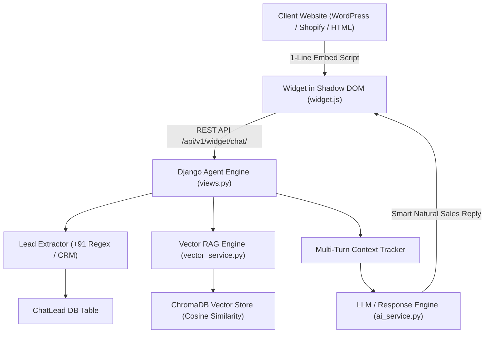

# 🤖 VyapaarOS AI Sales Agent & Embeddable Bot (Full Stack Platform)

> **Multi-Tenant B2B SaaS Platform jo kisi bhi website par 1-Line Embed Script ke through 24/7 AI Sales Executive deploy karta hai. Includes Multi-Source RAG, ChromaDB Vector Embeddings, Isolated Client Portals, Live CRM Lead Capture, and Claude-style Context Meter.**

---

## 🌟 Key Features

1. **⚡ 1-Line Script Embed (Shadow DOM):**
   - Kisi bhi WordPress, Shopify, Next.js ya Custom HTML site par bina CSS clash ke instantly deploy hota hai.
   ```html
   <script src="http://127.0.0.1:8000/static/widget.js" data-api-key="vyapaar_live_xxxx" defer></script>
   ```
2. **🧠 Persistent Vector Database (ChromaDB + ONNX RAG):**
   - Multi-tenant isolated vector collections har business client ke liye.
   - Semantic Cosine Similarity search — customer Hinglish / colloquial queries puchega tab bhi exact product match karega.
3. **📥 Multi-Source Knowledge Ingestion:**
   - **📕 PDF Reader (`pypdf`):** Brochures, menus, rate cards parse karta hai.
   - **📊 Excel / CSV Parser (`pandas`, `openpyxl`):** 100s-300s product rows ko instant vector database me convert karta hai.
   - **🌐 Website Crawler (`trafilatura`):** Zero-junk clean HTML parsing.
   - **✍️ Manual FAQs:** Custom rules aur discounts add karne ka support.
4. **🏢 Dedicated Business Owner Control Center:**
   - Client Login & Registration (`/login/`, `/register/`, `/dashboard/`).
   - Apni brand color, bot persona customize karne aur data feed karne ka portal.
5. **📱 Autonomous WhatsApp Lead Auto-Capture:**
   - Customer ka phone/WhatsApp number, name aur transcript realtime CRM me store hota hai.
6. **📊 Claude-style Circular Context Window Meter:**
   - Widget header me live pie gauge dikhata hai ki kitne tokens use huye hain.

---

## 🛠️ Installation & Setup Guide (Step-by-Step)

Naye system par project setup aur run karne ke liye ye steps follow karein:

### Step 1: Clone / Navigate to Project Directory
```powershell
cd C:\path\to\vyapaaros_ai_bot
```

### Step 2: Create Python Virtual Environment
```powershell
python -m venv venv
```

### Step 3: Activate Virtual Environment
```powershell
# Windows PowerShell:
.\venv\Scripts\Activate.ps1

# Windows CMD:
.\venv\Scripts\activate.bat
```

### Step 4: Install Dependencies from `requirements.txt`
```powershell
pip install -r requirements.txt
```

### Step 5: Run Database Migrations
```powershell
python manage.py makemigrations
python manage.py migrate
```

### Step 6: Create Superadmin Account (Optional if DB exists)
```powershell
python manage.py createsuperuser
# Default: admin / admin123
```

### Step 7: Start Django Development Server
```powershell
python manage.py runserver
```

---

## 🌐 Live URLs & Access Points

| Portal | URL | Credentials / Details |
| :--- | :--- | :--- |
| 🏠 **SaaS Landing Page** | `http://127.0.0.1:8000/` | Main advertisement landing page with 1-line copy widget |
| 👑 **Superadmin Panel** | `http://127.0.0.1:8000/admin/` | `admin` / `admin123` |
| 🔐 **Business Client Login** | `http://127.0.0.1:8000/login/` | Client Login Portal |
| 🎛️ **Business Control Dashboard**| `http://127.0.0.1:8000/dashboard/` | Data Ingestion (PDF/Excel), Leads table, Script tag |
| 🛋️ **Demo Store: Luxury Interiors** | `http://127.0.0.1:8000/demo/` | Client: *Luxe Interiors & Living* (`luxestore` / `client123`) |
| 🖥️ **Demo Store: Cyber Cafe** | `http://127.0.0.1:8000/cyber/` | Client: *Digital Point Cyber Cafe* (`digitalpoint` / `client123`) |
| 👗 **Demo Store: 300 Cloth Couture** | `http://127.0.0.1:8000/clothing/` | Client: *Vastra Heritage Couture* (`vastracollection` / `client123`) |

---

## 📁 Sample Test Files (Included in Root Directory)

Aapke dashboard se direct upload aur test karne ke liye ye files ready hain:
1. **`sample_luxe_catalog.pdf`**: Italian Sofas, Recliner rates, 2BHK/3BHK packages, 10-Year Warranty policy.
2. **`sample_cyber_cafe_rate_card.xlsx`**: Railway RRB NTPC forms, Passport apply, Print rates, Tatkal ticket booking.
3. **`sample_vastra_300_clothing_catalog.xlsx`**: 300 Designer Sarees, Bridal Lehengas, Sherwanis, Kurtis with colors, sizes and offers.

---

## 🏗️ Technical Architecture



---

## 🚀 Future Roadmap & Cloud Deployments
- [x] Multi-Tenant Architecture with 1-Line Script.
- [x] ChromaDB Persistent Vector Database.
- [x] Multi-Source Ingestion (PDF, Excel, Website Crawl).
- [x] Claude-style Context Meter & Ambiguity Clarification.
- [ ] Direct WhatsApp Business Cloud API Auto-Notification on new lead.
- [ ] Groq / Gemini API key direct toggle from Dashboard.
